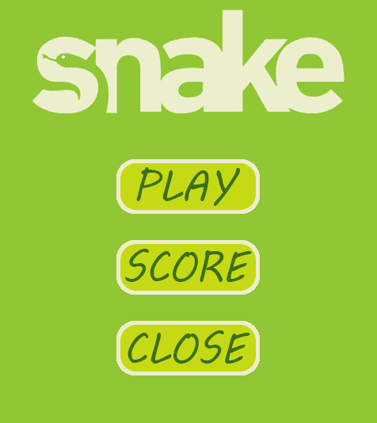
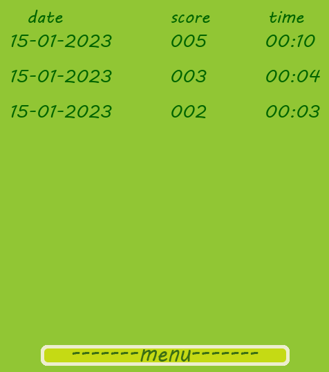
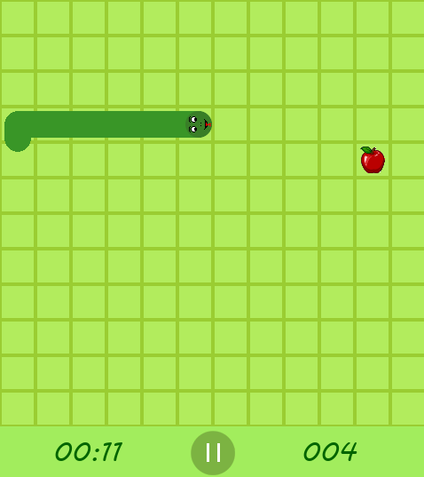
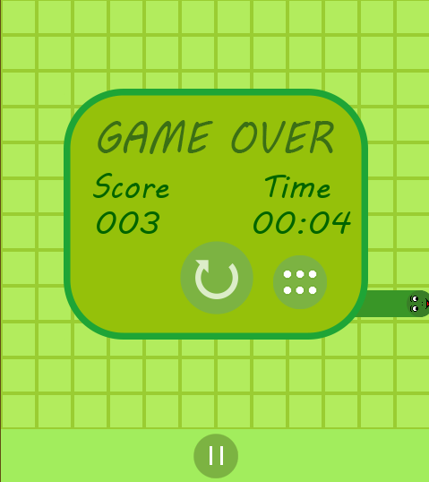
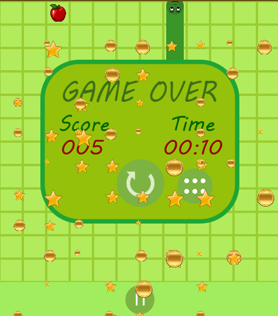

# Игра на pygame "Змейка"

Игра "Змейка" предназначена для развлечения, достижения игровых результатов и улучшения их.

### Как запустить:
1. Распакуйте архив: snake_game_project.zip
2. Запустите главную форму игры: main.py

### Как играть:
1. При запуске игры вы попадаете в главное меню  

* Здесь расположено три кнопки: "play" для начала игры, "score" для просмотра таблицы лучших результатов, "close" для закрытия игры.
2. При нажатии "score" открывается таблица лучших результатов  

* В первой колонке указана дата, когда был поставлен рекорд, во второй колонке - количество очков, а в третьей - игровое время. Записи в таблице упорядочены от большего счёта к меньшему, всего отображается 9 последних записей. Для выхода из таблицы в главное меню нажмите кнопку "menu" внизу окна.
3. При нажатии "play" в главном меню, запускается сама игра  

* Вы управляете змейкой с помощью стрелок на клавиатуре (правила игры будут даны далее в файле). Вы также можете остановить игру, нажав на значок паузы по центру внизу. Также в нижнем левом углу отображается игровое время, а в правом - текущий счёт.
4. Если игра заканчивается, появляется окно с информацией  

* Слева показан ваш итоговый счёт, справа - итоговое время. Нажав на кнопку по центру, вы снова начнёте игру, а нажав на кнопку справа - выйдете в главное меню.
5. Если вы побили свой предыдущий рекорд, окно конца игры будет отличаться  

* На экране появятся монеты и звёзды, а счёт и время будут выделены красным цветом. Результат будет сохранён в таблицу.

### Правила игры
* Цель игры - вырастить змейку (набрать максимально возможный счёт).
* Змейка растёт, когда съедает яблоко (наезжает на него головой).
* Когда яблоко съедено, оно появляется в другом месте на поле. На поле не может быть больше одного яблока.
* Когда змейка врезается в стенку (край поля) или в себя, игра заканчивается.

## Весёлой игры!
